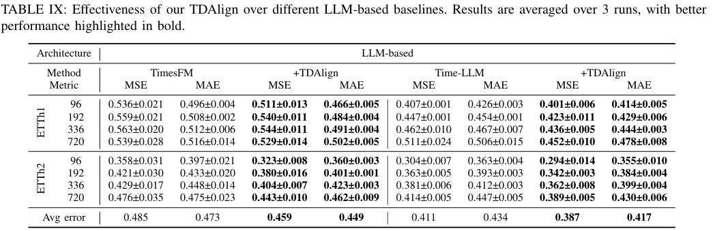

# TDAlign：Modeling Temporal Dependencies within the Target for Long-Term Time Series Forecasting
[](https://doi.org/10.1109/TKDE.2025.3609415)
[](https://arxiv.org/abs/2406.04777)

Welcome to the official repository of the TDAlign paper: [Modeling Temporal Dependencies within the Target for Long-Term Time Series Forecasting](https://doi.org/10.1109/TKDE.2025.3609415).


-  📰 **News(2025, 09)**: Our paper has been accepted by *IEEE Transactions on Knowledge and Data Engineering (TKDE)*.
-  📰 **News(2025, 12)**:  A revised version of our paper has been released, retitled as *"Modeling Temporal Dependencies within the Target for Long-Term Time Series Forecasting"*. The initial codebase was also released.
-  📰 **News(2024, 06)**: The initial arXiv preprint was released under the title *"TDT Loss Takes It All: Integrating Temporal Dependencies among Targets into Non-Autoregressive Time Series Forecasting"*.


## Introduction
Despite significant advancements in long-term time series forecasting (LTSF) research, we identify a performance bottleneck in existing LTSF methods caused by the inadequate modeling of Temporal Dependencies within the Target (TDT). 

To address this issue, we propose a novel and generic temporal modeling framework, Temporal Dependency Alignment (TDAlign), that equips existing LTSF methods with TDT learning capabilities. TDAlign is **a plug-and-play framework without introducing additional learnable parameters to the baseline**. It incurs minimal computational overhead, with only linear time complexity and constant space complexity relative to the prediction length.

### Key Designs
🌟 **Novel loss function ( $\mathcal{L}_D$ ):** aligns the change values between adjacent time steps in the predictions with those in the target, ensuring consistency with variation patterns.

🌟 **Adaptive loss balancing strategy ( $\rho$ ):** seamlessly integrates the new loss function with existing LTSF methods without introducing additional learnable parameters.

Regardless of the architectures and parameterizations, the vast majority of LTSF methods optimize a single conventional forecasting objective, denoted by $\mathcal{L}_Y$. With the integration of TDAlign, the overall loss function is reformulated as:

$$\mathcal{L} = \rho \mathcal{L}_Y + (1-\rho) \mathcal{L}_D$$

<div align="center">
  
</div>

### Results
<div align="center">
  
</div>
<div align="center">
  
</div>


### Efficiency
<div align="center">
  
</div>


## Getting Started

### Environment Preparation
```bash
pip install -r requirements.txt
```

### Data Preparation
All seven datasets for TDAlign are available at [Google Drive](https://drive.google.com/drive/folders/1ZOYpTUa82_jCcxIdTmyr0LXQfvaM9vIy) provided by [Autoformer](https://github.com/thuml/Autoformer).

### Running Experiments
We provide ready-to-use scripts for all major experiments, ensuring easy integration and reproducibility.
- Although these baselines maintain a consistent prediction length for each dataset, the required input lengths may vary depending on the architecture and training strategies of each model. 
- We do not use the **"Drop Last"** operation during testing for all experiments, as suggested by [TFB](https://arxiv.org/pdf/2403.20150).
- The `scripts/origin` folder contains scripts for baselines.
- The `scripts/improve` folder contains scripts for baselines enhanced with TDAlign. 

Example commands:
```bash
bash scripts/origin/run_itransformer_origin.sh
bash scripts/improve/run_itransformer_improve.sh
```

### Develop Your Own Models

Develop steps:
- Add the model file to the folder `models`.
- Include the newly added model in `exp/exp_main_improve.py`.
- Create the corresponding scripts under the folder `scripts/improve`.


## Citation
If you find this repo useful, please cite our paper.
```
@ARTICLE{11160655,
  author={Xiong, Qi and Tang, Kai and Ma, Minbo and Zhang, Ji and Xu, Jie and Li, Tianrui},
  journal={IEEE Transactions on Knowledge and Data Engineering}, 
  title={Modeling Temporal Dependencies within the Target for Long-Term Time Series Forecasting}, 
  year={2025},
  volume={},
  number={},
  pages={1-14},
  keywords={Time series analysis;long-term forecasting;temporal dependency},
  doi={10.1109/TKDE.2025.3609415}}
```

## Acknowledgement
We extend our heartfelt appreciation to the following GitHub repositories for providing valuable code bases or datasets:
- [Are Transformers Effective for Time Series Forecasting?](https://github.com/cure-lab/LTSF-Linear)
- [A Time Series is Worth 64 Words: Long-term Forecasting with Transformers](https://github.com/yuqinie98/PatchTST)
- [iTransformer: Inverted Transformers Are Effective for Time Series Forecasting](https://github.com/thuml/iTransformer)
- [MICN: Multi-scale Local and Global Context Modeling for Long-term Series Forecasting](https://github.com/wanghq21/MICN)
- [TimesNet: Temporal 2D-Variation Modeling for General Time Series Analysis](https://github.com/thuml/Time-Series-Library/blob/main/models/TimesNet.py)
- [SegRNN: Segment Recurrent Neural Network for Long-Term Time Series Forecasting](https://github.com/lss-1138/SegRNN)
- [Autoformer: Decomposition Transformers with Auto-Correlation for Long-Term Series Forecasting](https://github.com/thuml/Autoformer)

## Contact
If you have any questions about our work or code, please contact  xiongqi_111@outlook.com
